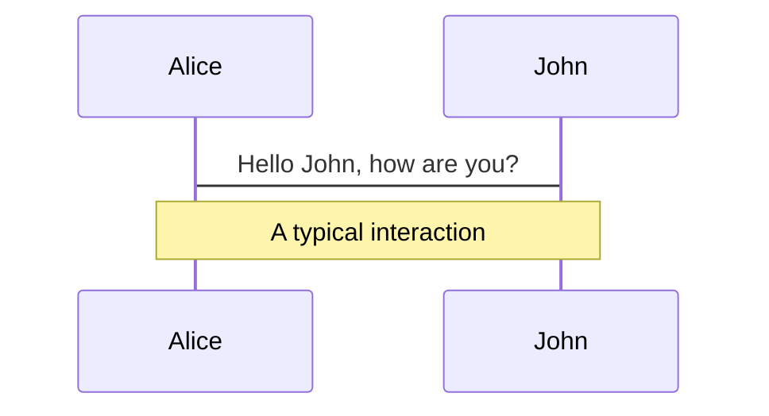
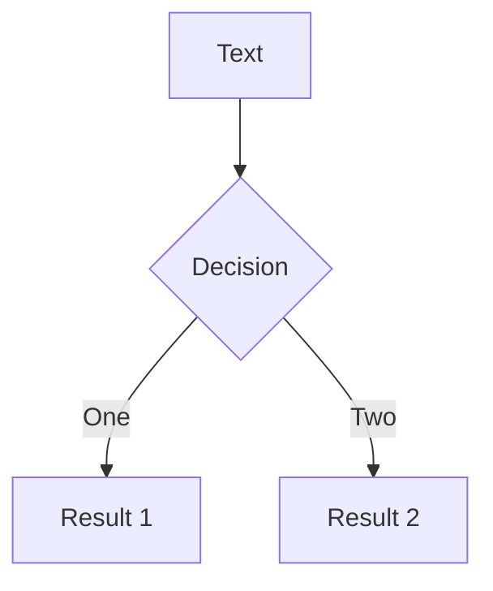
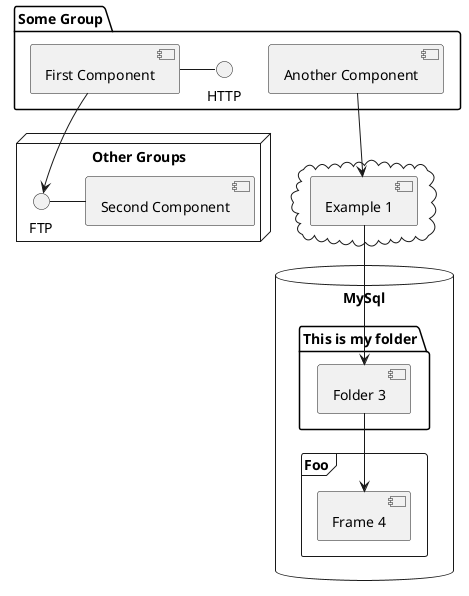

---
# try also 'default' to start simple
theme: seriph
# random image from a curated Unsplash collection by Anthony
# like them? see https://unsplash.com/collections/94734566/slidev
background: https://source.unsplash.com/collection/94734566/1920x1080
# apply any windi css classes to the current slide
class: 'text-center'
# https://sli.dev/custom/highlighters.html
highlighter: shiki
# show line numbers in code blocks
lineNumbers: false
# some information about the slides, markdown enabled
info: |
  ## Slidev Starter Template
  Presentation slides for developers.

  Learn more at [Sli.dev](https://sli.dev)
# persist drawings in exports and build
drawings:
  persist: false
# page transition
transition: fade-out
# use UnoCSS
css: unocss
fonts:
  sans: "Noto Sans Thai, Noto Sans"
  serif: "Noto Serif Thai"
  mono: "Fira Code"
---

# HTML + CSS

มาเรียน HTML กับ CSS กันดีกว่า

<!--
The last comment block of each slide will be treated as slide notes. It will be visible and editable in Presenter Mode along with the slide. [Read more in the docs](https://sli.dev/guide/syntax.html#notes)
-->

---
transition: slide-left
---

# HTML คืออะไร

HTML เป็นภาษาที่หลักที่ใช้ในการเขียนเว็บ หน้าที่ของ HTML คือการบอกว่าส่วนไหนของเว็บคืออะไร
รวมถึงการจัดเนื้อหาต่าง ๆ เช่น รูปภาพ วิดีโอ หรือลิงก์

HTML ย่อมาจาก HyperText Markup Language

## ตัวอย่าง HTML

```html
<!DOCTYPE html>
<html>
  <head>
    <title>Exceed Impact</title>
  </head>
  <body>
    <h1>Hello, World</h1>
  </body>
</html>
```


<!--
อันนี้ให้สอนตาม slide ได้เลย
-->

<style>
h1 {
  background-color: #2B90B6;
  background-image: linear-gradient(45deg, #4EC5D4 10%, #146b8c 20%);
  background-size: 100%;
  -webkit-background-clip: text;
  -moz-background-clip: text;
  -webkit-text-fill-color: transparent;
  -moz-text-fill-color: transparent;
}
</style>

<!--
Here is another comment.
-->

---
transition: slide-left
---

# ส่วนประกอบของ HTML

HTML ประกอบด้วย tag เช่น `html`, `body`, `h1` แต่ละ tag จะครอบด้วยเครื่องหมาย `<>` และปิดด้วย `</>`
เช่น `<h1>Hello, World</h1>` จะเป็น tag `h1` ที่มีข้อความ `Hello, World` อยู่ด้านใน

สำหรับบาง tag จะมี attribute ที่สามารถใส่เข้าไปได้ เช่น `a` เป็น tag ที่ใช้แสดงลิงก์ไปหน้าอื่น ๆ
จะใส่ `href` เพื่อบอกว่าไปไหน ส่วนข้อความด้านใน tag จะเป็นข้อความที่แสดงขึ้นมา

```html
<a href="https://www.youtube.com/watch?v=mW61VTLhNjQ" target="_blank">Totally not a rickroll</a>
```

<a href="https://www.youtube.com/watch?v=mW61VTLhNjQ" target="_blank">Totally not a rickroll</a>


---
transition: slide-left
---

# ส่วนประกอบของไฟล์ HTML

ในไฟล์ HTML ปกติจะแบ่งออกเป็น
- Doctype ที่จะบอก version ของตัว HTML (ควรใส่)
- Head จะบอก title (ชื่อหน้าเว็บ), รวม CSS กับ JavaScript, รวมถึง metadata อย่างเช่น description ของตัวเว็บ
  ส่วนนี้จำสำคัญเวลาทำ SEO (ทำให้เว็บขึ้น Google) และก็แชร์ social media
- Body แสดงหน้าเว็บและอาจจะมี script เพิ่มเติมที่ไม่ได้อยู่ใน head

ทั้งไฟล์ HTML จะถูกครอบด้วย tag `html`

เรื่อง JavaScript จะพูดกันในวันหน้า ๆ นะครับ

---
transition: slide-left
---

# ตัวอย่างไฟล์ HTML

```html {all|2-6|7-12}
<html>
  <head>
    <title>Hutao's Workshop</title>
    <link rel="stylesheet" href="index.css" >
    <script src="index.js" />
  </head>
  <body>
    <main>
      <h1>Hutao's Workshop</h1>
      <p>Hutao is the best girl in Genshin Impact.</p>
    </main>
  </body>
</html>
```


<style>
.footnotes-sep {
  @apply mt-20 opacity-10;
}
.footnotes {
  @apply text-sm opacity-75;
}
.footnote-backref {
  display: none;
}
</style>

---

# Components

<div grid="~ cols-2 gap-4">
<div>

You can use Vue components directly inside your slides.

We have provided a few built-in components like `<Tweet/>` and `<Youtube/>` that you can use directly. And adding your custom components is also super easy.

```html
<Counter :count="10" />
```

<!-- ./components/Counter.vue -->
<Counter :count="10" m="t-4" />

Check out [the guides](https://sli.dev/builtin/components.html) for more.

</div>
<div>

```html
<Tweet id="1390115482657726468" />
```

<Tweet id="1390115482657726468" scale="0.65" />

</div>
</div>

<!--
Presenter note with **bold**, *italic*, and ~~striked~~ text.

Also, HTML elements are valid:
<div class="flex w-full">
  <span style="flex-grow: 1;">Left content</span>
  <span>Right content</span>
</div>
-->


---
class: px-20
---

# Themes

Slidev comes with powerful theming support. Themes can provide styles, layouts, components, or even configurations for tools. Switching between themes by just **one edit** in your frontmatter:

<div grid="~ cols-2 gap-2" m="-t-2">

```yaml
---
theme: default
---
```

```yaml
---
theme: seriph
---
```


</div>

Read more about [How to use a theme](https://sli.dev/themes/use.html) and
check out the [Awesome Themes Gallery](https://sli.dev/themes/gallery.html).

---
preload: false
---

# Animations

Animations are powered by [@vueuse/motion](https://motion.vueuse.org/).

```html
<div
  v-motion
  :initial="{ x: -80 }"
  :enter="{ x: 0 }">
  Slidev
</div>
```

<div class="w-60 relative mt-6">
  <div class="relative w-40 h-40">
    
    
    
  </div>

  <div
    class="text-5xl absolute top-14 left-40 text-[#2B90B6] -z-1"
    v-motion
    :initial="{ x: -80, opacity: 0}"
    :enter="{ x: 0, opacity: 1, transition: { delay: 2000, duration: 1000 } }">
    Slidev
  </div>
</div>

<!-- vue script setup scripts can be directly used in markdown, and will only affects current page -->
<script setup lang="ts">
const final = {
  x: 0,
  y: 0,
  rotate: 0,
  scale: 1,
  transition: {
    type: 'spring',
    damping: 10,
    stiffness: 20,
    mass: 2
  }
}
</script>

<div
  v-motion
  :initial="{ x:35, y: 40, opacity: 0}"
  :enter="{ y: 0, opacity: 1, transition: { delay: 3500 } }">

[Learn More](https://sli.dev/guide/animations.html#motion)

</div>

---

# LaTeX

LaTeX is supported out-of-box powered by [KaTeX](https://katex.org/).

<br>

Inline $\sqrt{3x-1}+(1+x)^2$

Block
$$
\begin{array}{c}

\nabla \times \vec{\mathbf{B}} -\, \frac1c\, \frac{\partial\vec{\mathbf{E}}}{\partial t} &
= \frac{4\pi}{c}\vec{\mathbf{j}}    \nabla \cdot \vec{\mathbf{E}} & = 4 \pi \rho \\

\nabla \times \vec{\mathbf{E}}\, +\, \frac1c\, \frac{\partial\vec{\mathbf{B}}}{\partial t} & = \vec{\mathbf{0}} \\

\nabla \cdot \vec{\mathbf{B}} & = 0

\end{array}
$$

<br>

[Learn more](https://sli.dev/guide/syntax#latex)

---

# Diagrams

You can create diagrams / graphs from textual descriptions, directly in your Markdown.

<div class="grid grid-cols-3 gap-10 pt-4 -mb-6">







</div>

[Learn More](https://sli.dev/guide/syntax.html#diagrams)

---
src: ./pages/multiple-entries.md
hide: false
---

---
layout: center
class: text-center
---

# Learn More

[Documentations](https://sli.dev) · [GitHub](https://github.com/slidevjs/slidev) · [Showcases](https://sli.dev/showcases.html)
